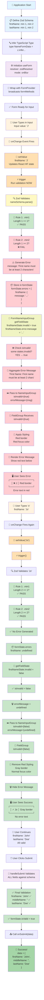

```mermaid
graph TD
    Start["🎯 Application Start"] --> Schema["📋 Define Zod Schema<br/>firstName: min 1, min 2<br/>lastName: min 1, min 2"]
    
    Schema --> TypeInfer["🔤 Infer TypeScript Type<br/>type NameFormData = z.infer..."]
    TypeInfer --> FormInit["⚙️ Initialize useForm<br/>resolver: zodResolver<br/>mode: onBlur"]
    
    FormInit --> Provider["🔄 Wrap with FormProvider<br/>broadcasts formMethods"]
    Provider --> Ready["✅ Form Ready for Input"]
    
    Ready --> UserTypes["👤 User Types in Input<br/>Input value: 'J'"]
    UserTypes --> OnChange["🔔 onChange Event Fires"]
    
    OnChange --> SetValue["💾 setValue<br/>firstName: 'J'<br/>Updates React HF state"]
    SetValue --> Trigger["⚡ trigger<br/>Run validation NOW"]
    
    Trigger --> ZodValidate["🔍 Zod Validates<br/>nameSchema.parse()"]
    ZodValidate --> Rule1["📏 Rule 1: .min1<br/>Length 1 >= 1?<br/>✅ PASS"]
    
    Rule1 --> Rule2["📏 Rule 2: .min2<br/>Length 1 >= 2?<br/>❌ FAIL"]
    Rule2 --> ErrorGen["⚠️ Generate Error<br/>message: 'First name must<br/>be at least 2 characters'"]
    
    ErrorGen --> StoreError["📦 Store in formState<br/>formState.errors = {<br/>  firstName: {<br/>    message: '...'<br/>  }<br/>}"]
    
    StoreError --> GetState["🎯 FormNameInputGroup<br/>getFieldState<br/>firstNameState.invalid = true<br/>firstNameState.error.message = '...'"]
    
    GetState --> IsInvalid["❌ Check isInvalid<br/>some states.invalid?<br/>YES → true"]
    IsInvalid --> ErrorMsg["📝 Aggregate Error Message<br/>'First Name: First name<br/>must be at least 2 chars'"]
    
    ErrorMsg --> PassProps["➡️ Pass to NameInputGroup<br/>isInvalid={true}<br/>errorMessage={msg}"]
    PassProps --> FieldGroup["🎨 FieldGroup Receives<br/>isInvalid={true}"]
    
    FieldGroup --> ApplyStyle["🌈 Apply Styling<br/>Red border<br/>Red focus color"]
    ApplyStyle --> RenderError["📱 Render Error Message<br/>Show red text below"]
    
    RenderError --> Display["🖥️ User Sees Error<br/>┌──────────────┐<br/>│ ❌ J         │ Red border<br/>└──────────────┘<br/>Error text in red"]
    
    Display --> UserTypes2["👤 User Types 'o'<br/>firstName: 'Jo'"]
    UserTypes2 --> OnChange2["🔔 onChange Fires Again"]
    
    OnChange2 --> SetValue2["💾 setValue('Jo')"]
    SetValue2 --> Trigger2["⚡ trigger()"]
    Trigger2 --> ZodValidate2["🔍 Zod Validates 'Jo'"]
    
    ZodValidate2 --> Rule1_2["📏 Rule 1: .min1<br/>Length 2 >= 1?<br/>✅ PASS"]
    Rule1_2 --> Rule2_2["📏 Rule 2: .min2<br/>Length 2 >= 2?<br/>✅ PASS"]
    
    Rule2_2 --> NoError["✅ No Error Generated"]
    NoError --> StoreOK["📦 formState.errors<br/>firstName: undefined"]
    
    StoreOK --> GetState2["🎯 getFieldState<br/>firstNameState.invalid = false"]
    GetState2 --> IsInvalid2["✅ isInvalid = false"]
    IsInvalid2 --> ErrorMsg2["🗑️ errorMessage = undefined"]
    
    ErrorMsg2 --> PassProps2["➡️ Pass to NameInputGroup<br/>isInvalid={false}<br/>errorMessage={undefined}"]
    PassProps2 --> FieldGroup2["🎨 FieldGroup<br/>isInvalid={false}"]
    
    FieldGroup2 --> RemoveStyle["🌈 Remove Red Styling<br/>Gray border<br/>Normal focus color"]
    RemoveStyle --> NoErrorDisplay["🗑️ Hide Error Message"]
    
    NoErrorDisplay --> Display2["🖥️ User Sees Success<br/>┌──────────────┐<br/>│ ✓ Jo         │ Gray border<br/>└──────────────┘<br/>No error text"]
    
    Display2 --> Continue["👤 User Continues<br/>firstName: 'John'<br/>lastName: 'Doe'<br/>All valid"]
    
    Continue --> Submit["🖱️ User Clicks Submit"]
    Submit --> HandleSubmit["🔐 handleSubmit Validates<br/>ALL fields against schema"]
    
    HandleSubmit --> FinalValidate["✅ Final Validation<br/>firstName: 'John' ✅<br/>middleName: '' ✅<br/>lastName: 'Doe' ✅"]
    
    FinalValidate --> AllValid["✅ formState.isValid = true"]
    AllValid --> CallOnSubmit["📤 Call onSubmit(data)"]
    
    CallOnSubmit --> Success["🎉 Success!<br/>data = {<br/>  firstName: 'John',<br/>  middleName: '',<br/>  lastName: 'Doe'<br/>}"]
    
    style Start fill:#e1f5ff
    style Schema fill:#e3f2fd
    style FormInit fill:#f3e5f5
    style UserTypes fill:#fff3e0
    style OnChange fill:#fff3e0
    style SetValue fill:#ffe0b2
    style Trigger fill:#ffe0b2
    style ZodValidate fill:#fff9c4
    style Rule1 fill:#c8e6c9
    style Rule2 fill:#ffcdd2
    style ErrorGen fill:#ffcdd2
    style StoreError fill:#ffcdd2
    style GetState fill:#f0f4c3
    style IsInvalid fill:#ffcdd2
    style ErrorMsg fill:#ffcdd2
    style PassProps fill:#ffcdd2
    style FieldGroup fill:#ffcdd2
    style ApplyStyle fill:#ffcdd2
    style RenderError fill:#ffcdd2
    style Display fill:#ffcdd2
    style UserTypes2 fill:#fff3e0
    style SetValue2 fill:#ffe0b2
    style Trigger2 fill:#ffe0b2
    style Rule1_2 fill:#c8e6c9
    style Rule2_2 fill:#c8e6c9
    style NoError fill:#c8e6c9
    style StoreOK fill:#c8e6c9
    style GetState2 fill:#c8e6c9
    style IsInvalid2 fill:#c8e6c9
    style ErrorMsg2 fill:#c8e6c9
    style PassProps2 fill:#c8e6c9
    style FieldGroup2 fill:#c8e6c9
    style RemoveStyle fill:#c8e6c9
    style NoErrorDisplay fill:#c8e6c9
    style Display2 fill:#c8e6c9
    style HandleSubmit fill:#f3e5f5
    style FinalValidate fill:#c8e6c9
    style AllValid fill:#c8e6c9
    style Success fill:#a5d6a7
```
